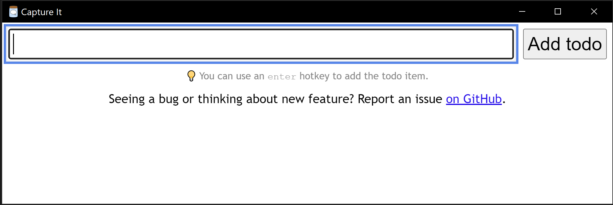

# Capture It

A simple app to instantly add notes to your todo list.



## Configuration

During the first run you'll have to provide the configuration.

The app will ask you to do that and allow guide you though creating a file.

In case it doesn't, just copy the [.capture-it-config.tpl.json](.capture-it-config.tpl.json) file to `~/.capture-it-config.json` and fill in the placeholder values.

### `notionToken`

You need to provide Notion's token first. Luckily, you need to create integration only once as it's much more complicated than it should be.

1. Go to https://www.notion.so/my-integrations
1. Click "New integration" button.
1. Name it "Capture It (local)".
1. Click "Submit".
1. Click "Show" to see the token.
1. Click "Copy" to copy it to your clipboard.
1. Paste it as a `notionToken` property.

From here be sure to add "Capture It (local)" integration to any database / Notion page you want the app to interact with.

## Dev

Clone the repo and go for:

```sh
git clone git@github.com:mlewand/capture-it.git
cd capture-it
yarn
yarn start:dev
```

## Distribution

Run the following steps to build distribution version of the app:

```sh
yarn dist
```
