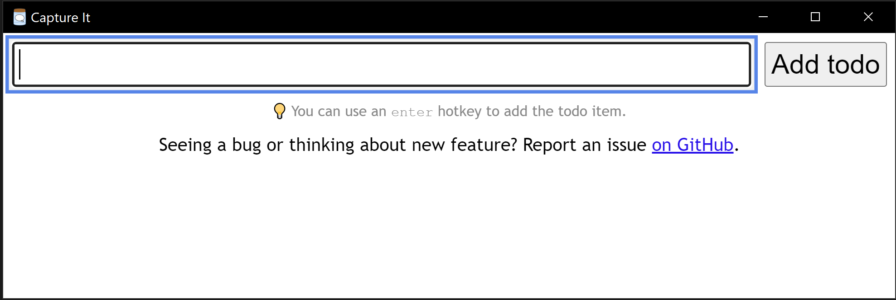

# Capture It

A simple app to instantly add notes to your todo list.



Main goals of the app:

* Lighting fast, above all - it has to pop up and disappear in a blink of an eye.
* Easy - start with limited set of features.
* Quick to develop - new ideas should be implemented fast and easy.

It wasn't mean to be a state of art app, so the source code has shortcuts and is messy in many places.

## Installation

Just grab a suitable distribution from [the releases page](https://github.com/mlewand/capture-it/releases).

## Configuration

During the first run you'll have to provide the configuration.

The app will ask you to do that and allow guide you though creating a file.

In case it doesn't, just copy the [.capture-it-config.tpl.jsonc](.capture-it-config.tpl.jsonc) file to `~/.capture-it-config.json` and fill in the placeholder values.

## Dev

Clone the repo and go for:

```sh
git clone git@github.com:mlewand/capture-it.git
cd capture-it
yarn
cd packages/capture-it-desktop-app
yarn start:dev
```

## Distribution

Run the following steps to build distribution version of the app:

```sh
yarn dist
```
